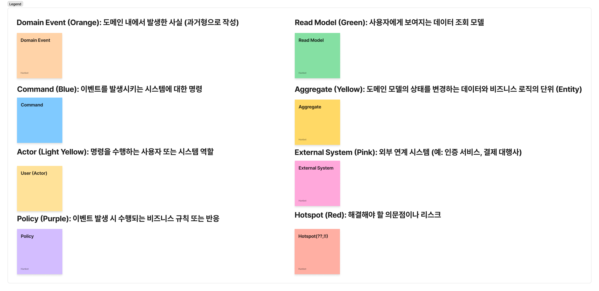
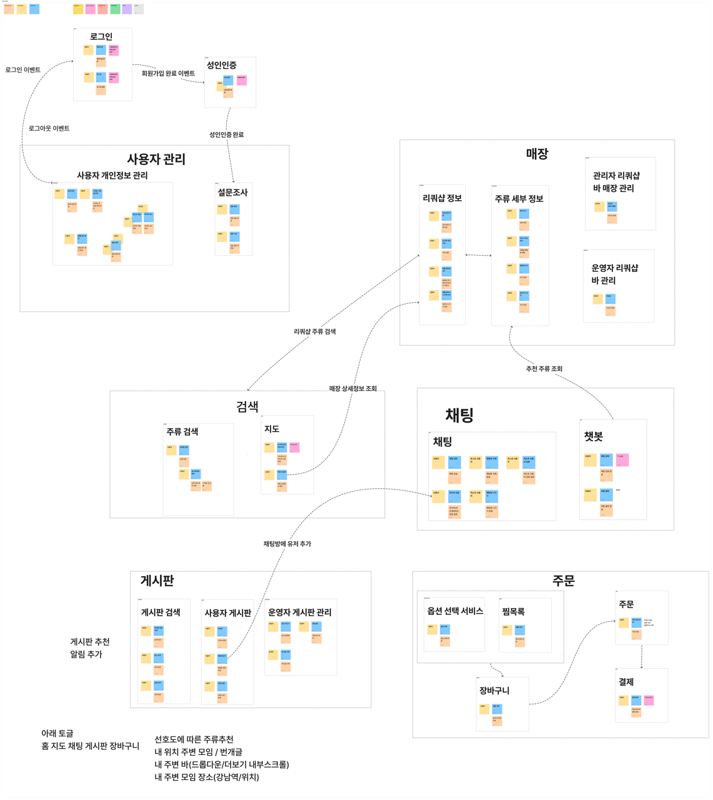

# 이벤트 스토밍 - 버전 1

**언어:** [EN](README.md) / [KR](README.kr.md)

## 개요
본 문서는 "온더블록" 애플리케이션의 이벤트 스토밍 다이어그램을 설명합니다. 이 다이어그램은 시스템 내의 다양한 도메인, 서비스, 및 핵심 상호작용을 매핑합니다.

## 범례

이벤트 스토밍 다이어그램은 다음의 색상 코드 요소를 사용합니다:

| 요소 | 색상 | 설명 |
|------|------|------|
| **도메인 이벤트** | 주황색 | 도메인에서 발생하는 사실 (과거형 작업) |
| **커맨드** | 파란색 | 시스템에서 이벤트를 트리거하는 명령 |
| **액터** | 옅은 노란색 | 커맨드를 실행하는 사용자 또는 시스템 역할 |
| **정책** | 보라색 | 이벤트로 트리거되는 비즈니스 규칙 또는 반응 |
| **읽기 모델** | 녹색 | 사용자에게 제시되는 데이터 조회 모델 |
| **애그리게이트** | 노란색 | 도메인 상태 및 비즈니스 로직 경계를 나타내는 엔티티 |
| **외부 시스템** | 핑크색 | 제3자 또는 외부 통합 시스템 |
| **핫스팟** | 빨간색 | 해결이 필요한 질문, 위험, 또는 문제 |

## 이벤트 스토밍 다이어그램 - 버전 1

Date: 2026-03-27

## 이벤트 스토밍 다이이그램 - 버전 2

Date: 2026-04-03

