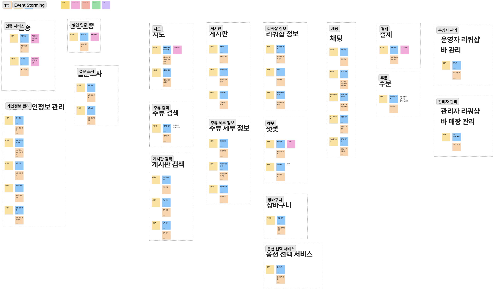

# Event Storming - Version 1

**Language:** [EN](README.md) / [KR](README.kr.md)

## Overview
This document describes the Event Storming diagram for the "On The Block" application, version 1. 
The diagram maps out the various domains, services, and key interactions within the system.

## Legend

The Event Storming diagram uses the following color-coded elements:

| Element | Color | Description |
|---------|-------|-------------|
| **Domain Event** | Orange | Facts that occur in the domain (past tense actions) |
| **Command** | Blue | Instructions that trigger events in the system |
| **Actor** | Light Yellow | Users or system roles that execute commands |
| **Policy** | Purple | Business rules or reactions triggered by events |
| **Read Model** | Green | Data query models presented to users |
| **Aggregate** | Yellow | Entity representing domain state and business logic boundaries |
| **External System** | Pink | Third-party or external integrated systems |
| **Hotspot** | Red | Questions, risks, or issues that need to be resolved |

 <!--  -->

## Event Storming Diagram - Version 1

<!--  -->